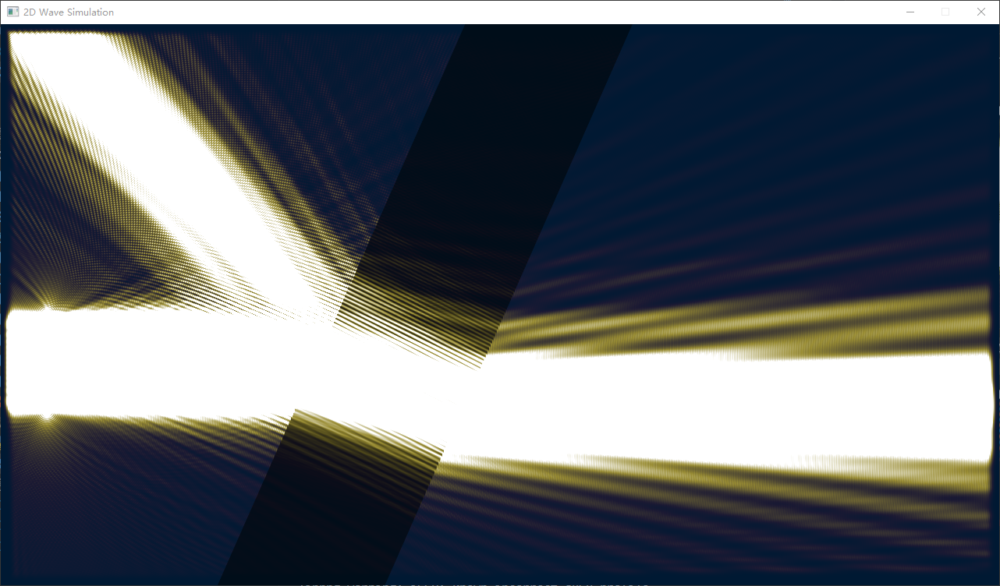
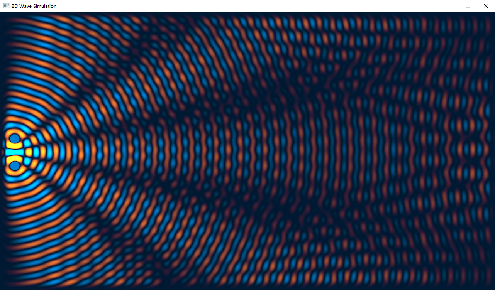

# 2D Wave

基于openGL的2D波场模拟器  

<!-- py .\needy_wave.py .\terrains\terrain1.png --wave-source-freq=35 --wave-source-amp=4 -->

<!-- py .\needy_wave.py .\terrains\terrain3.png --render-wave-view --wave-source-freq=5 -->


    本模拟器采用GPU加速运算，虽然不敢自称“高性能”，但是比纯CPU运算快得多。

## 使用方法

使用之前，你需要先安装依赖
```
pip install -r requirements.txt
```

使用方法如下：
```
py needy_wave.py TERRAIN_PATH [OPTIONS]
```

举两个例子: 
```
py .\needy_wave.py .\terrains\terrain1.png --wave-source-freq=35 --wave-source-amp=4
```

```
py .\needy_wave.py .\terrains\terrain3.png --render-wave-view --wave-source-freq=5
```
